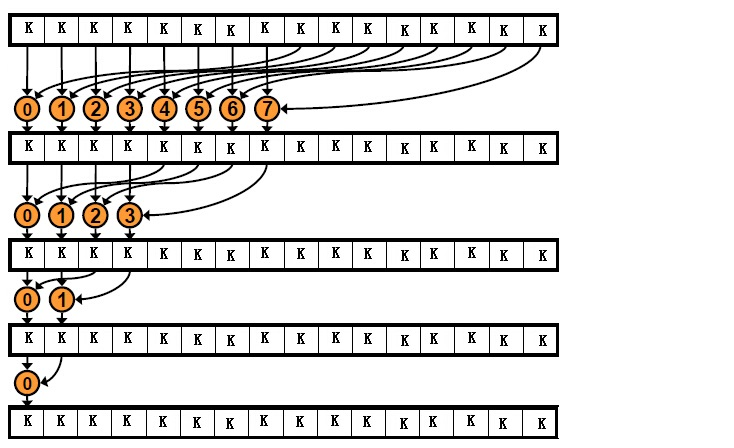
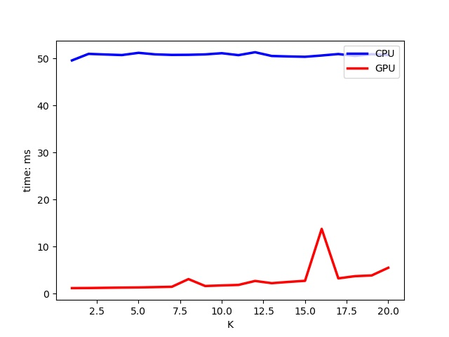

### CUDA Top K

### 问题描述

从一组数据中(float类型的数组array)选出最大的K个数据，使用CUDA并行算法在Nvidia GPU上实现加速。


### 小组成员

* 分组成员(姓名)
	* 于献智
	* 周冬炎
	* 郭云龙
	* 程云观
	* 颜闻


### 解决思路

借鉴经典的CUDA版本的**归并排序**和**归约求和**的并行思想。每个线程保存了局部的Top K值，然后两两线程合并出新的K个最大，直至合并出最终的结果，算法如图所示。并且使用GPU块内共享内存加速，但是加速求解的规模有限（GPU块内共享内存是48KB，对于float类型数据，如果每个block有128个线程，那么至多能求解K的最大为96，96=48*1024/4/128），如果超过块内共享内存求解规模时候使用全局内存替代。




### 编译

 使用[Makefile](Makefile)管理编译命令，可以直接执行```make```命令生成可执行文件```main```


### 运行

* 请提前准备好输入文件```input.txt```，以1维数组形式保存了float类型数据，下面是运行命令，可执行文件```main```，输入文件```input.txt```，1维数组大小N，要选取的K的值。

```bash
./main ./input.txt N K
```

* 也可以直接使用我们的[run.sh](run.sh)测试脚本，我们使用[random_init.sh](random_init.sh)生成的70000000数据的测试脚本测试。


### 测试

* 程序输出包含了CPU的运行时间（ms）和运行结果，以及GPU的运行时间（ms）和运行结果。然后使用```Python```的```matplotlib```模块画图。

* 测试硬件信息
	* CPU: Intel(R) Xeon(R) CPU E5-2670 0 @ 2.60GHz（ core 16/ memory 128GB）
	* GPU: GeForce GTX TITAN X （memory 12GB）

* 测试软件信息
	* OS: Ubuntu 14.04
	* G++: 5.4.1
	* NVCC: 8.0

* 测试结果
	* 测试选用了求解Top1 - 20的问题规模，输入数据是70000000个float大小，CPU的求解代码[top_k_cpu.cpp](top_k_cpu.cpp)，自己实现的GPU的求解代码[top_k_gpu.cu](top_k_gpu.cu)，取得了一块 TITAN X相当于46个CPU核的加速。同时使用GPU自带的Thrust并行函数库的sort函数实现了一个top-k的算法（通过排序然后选取前K个最大的）的代码[top_k_thrust.cu](top_k_thrust.cu).但是因为Thrust库处理的数据规模较小的时候加速效果并不明显，70000000数据的Top1-20的问题执行需要几千毫秒，没有能充分发挥出GPU加速的效果，所以这里没有参与比较。
	* 当K的规模增大的时候，块内共享内存几乎被一个Block占据，所以硬件上一个SM不能调度更多的GPU Block执行，降低了Block层级的并行度。
	* 这里的TOP 8和TOP 16加速性能下降，可能是因为块内共享内存的Bank Conflict发生导致的性能下降，本来一次访问可以访问的数据需要多次访问，但是整体上加速性能40多倍。
	

